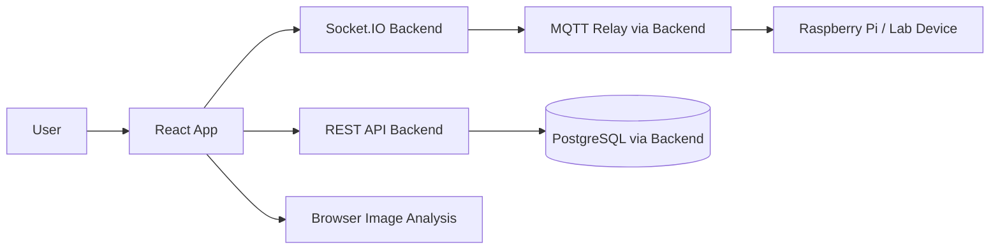
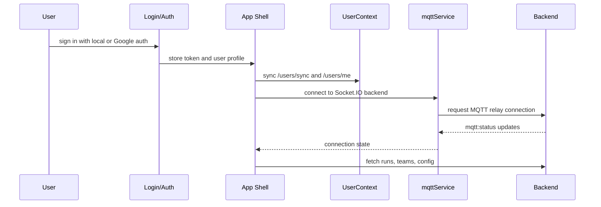
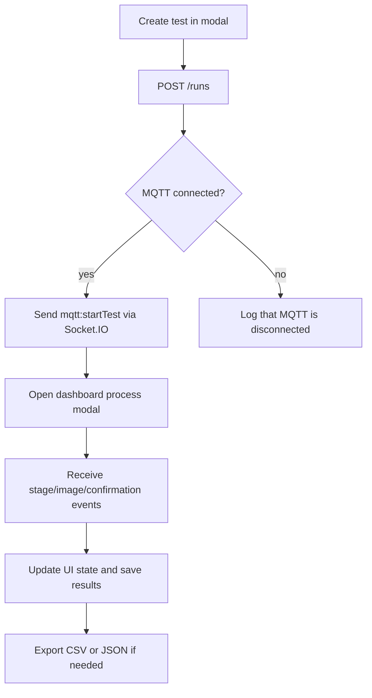
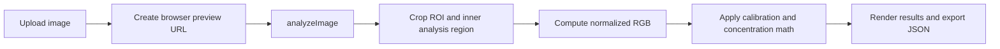

# Frontend Overview

## Purpose

This repository contains the UR2 frontend: a React-based dashboard for creating tests, monitoring live device progress, managing teams, and running offline image analysis. It acts as the user-facing control plane for the lab workflow and integrates with the backend through REST, Socket.IO, and MQTT relay events.

The main application entry point is [src/App.js](src/App.js), with supporting state, UI, and analysis logic distributed across the `src/` tree.

## System Architecture

## High-Level Structure

- [src/index.js](src/index.js) bootstraps React and loads global CSS.
- [src/App.js](src/App.js) owns top-level routing, login state, MQTT connection state, and dashboard shell layout.
- [src/context/UserContext.jsx](src/context/UserContext.jsx) syncs user profile and team membership from backend JWT state.
- [src/mqtt/mqttservice.jsx](src/mqtt/mqttservice.jsx) wraps Socket.IO and exposes an MQTT-like client API to the UI.
- [src/config/api.js](src/config/api.js) defines the API base URL.
- [src/components/](src/components) contains the dashboard, auth, admin, and shared UI components.
- [src/utils/](src/utils) contains the image-analysis math and browser canvas pipeline.

## Application Flow

## Runtime and Build Stack

- React 19 via `react` and `react-dom`
- React Router v7
- Tailwind CSS utility classes
- Material UI for the stepper component
- lucide-react icons
- socket.io-client for realtime transport
- MQTT.js is present in dependencies, but the browser service is implemented through Socket.IO relay rather than direct broker access

### Package Notes

The declared scripts are standard CRA scripts:

- `npm start`
- `npm run build`
- `npm test`

There is no custom test runner or lint script beyond the default CRA setup in [package.json](package.json).

## UI Composition

### App Shell

[src/App.js](src/App.js) is the core composition layer. It handles:

- Browser routing for `/login`, `/auth/callback`, and the authenticated dashboard
- Persistent user/token state from `localStorage`
- MQTT connection buttons and status
- The top navigation shell, dashboard header, console, and create-test modal

### Navigation and Dashboard

- [src/components/dashboard/Sidebar.jsx](src/components/dashboard/Sidebar.jsx) provides left navigation and user/logout controls.
- [src/components/dashboard/MainView.jsx](src/components/dashboard/MainView.jsx) switches between Home, Image Analysis, and Settings.
- [src/components/dashboard/Console.jsx](src/components/dashboard/Console.jsx) renders the log stream at the bottom of the dashboard.

### Auth Flow

- [src/components/auth/Login.jsx](src/components/auth/Login.jsx) supports username/password login and Google sign-in.
- [src/components/auth/AuthCallback.jsx](src/components/auth/AuthCallback.jsx) parses the returned JWT from the OAuth redirect and stores it locally.

### Operational Pages

- [src/components/sections/Home.jsx](src/components/sections/Home.jsx) is the primary operations surface for runs and live process tracking.
- [src/components/sections/ImageAnalysis.jsx](src/components/sections/ImageAnalysis.jsx) performs manual browser-side image analysis from uploaded files.
- [src/components/sections/Settings.jsx](src/components/sections/Settings.jsx) hosts MQTT and team-management admin tabs.

### Shared UI

- [src/components/ui/CreateTestModal.jsx](src/components/ui/CreateTestModal.jsx) creates runs and can trigger the test start command.
- [src/components/ui/ProcessModalNew.jsx](src/components/ui/ProcessModalNew.jsx) is the richer live process viewer with camera preview, manual confirmations, and result export.
- [src/components/ui/ProcessModal.jsx](src/components/ui/ProcessModal.jsx) is a simpler legacy process viewer that still exists alongside the newer version.
- [src/components/ui/TestDetailsModal.jsx](src/components/ui/TestDetailsModal.jsx) shows run history and exports CSV.
- [src/components/ui/TestRunCard.jsx](src/components/ui/TestRunCard.jsx) renders per-run actions.
- [src/components/ui/ConfirmationModal.jsx](src/components/ui/ConfirmationModal.jsx) handles confirmation prompts during the workflow.
- [src/components/ui/UR2Stepper.jsx](src/components/ui/UR2Stepper.jsx) renders the responsive stepper.

## Core Data Flow

The frontend has two major operational modes:

1. Dashboard mode for managing runs, teams, and MQTT-connected device workflows.
2. Offline image-analysis mode for uploading an image and computing aluminum/silicon results in the browser.

### Run Lifecycle

### Image Analysis Workflow

## Image Analysis Layer

The image-analysis pipeline is split cleanly between math and browser-specific code:

- [src/utils/imageAnalysis.js](src/utils/imageAnalysis.js) contains pure functions for ROI clamping, crop geometry, mean RGB, calibration, concentration, and dissolution calculations.
- [src/utils/imageAnalysisRunner.js](src/utils/imageAnalysisRunner.js) owns the browser canvas pipeline and object URL generation.

This is one of the strongest architectural parts of the frontend because the pure math is isolated from the DOM, which makes backend migration or unit testing much easier.

## State and Integration Analysis

### User State

[src/context/UserContext.jsx](src/context/UserContext.jsx) is responsible for:

- Loading the JWT token from localStorage
- Syncing the authenticated user into the backend database
- Fetching the enriched profile with team metadata
- Exposing helpers such as `refreshProfile`, `clearProfile`, and role-derived booleans

This is a sensible boundary, but it overlaps somewhat with the local auth state that is also stored in [src/App.js](src/App.js), which means user/session logic is split across two layers.

### Realtime and Device Bridge

[src/mqtt/mqttservice.jsx](src/mqtt/mqttservice.jsx) is a socket-backed MQTT facade. It:

- Opens a Socket.IO connection to the backend
- Requests backend-side MQTT connect/disconnect actions
- Exposes MQTT-like `publish`, `subscribe`, and `on('message')` behavior for components
- Relays `mqtt:status`, `mqtt:stage`, `mqtt:image`, and `mqtt:image:raw` events to the UI

This is a pragmatic compatibility layer, but it is also a sign that the frontend is carrying legacy MQTT semantics that could be simplified if the UI were rewritten directly around domain events instead of transport-shaped methods.

## Styling and UX

- Tailwind is used directly in JSX, with only a very small [tailwind.config.js](tailwind.config.js) extension.
- Global CSS in [src/index.css](src/index.css) is minimal and mostly defaults to system fonts.
- The UI is functional and readable, but visually conservative and heavily driven by utility classes rather than a dedicated design system.

The app is usable on mobile and desktop, and the stepper is responsive, but the styling language is inconsistent across modules because components were added over time rather than designed as one cohesive visual system.

## Maintainability Assessment

### Strengths

- The image-analysis math is well separated from the browser-specific analysis runner.
- Team, auth, and MQTT flows are all implemented in the frontend rather than being hidden behind opaque abstractions.
- The component set is logically grouped by feature area.
- The app includes reusable modals and a live console, which makes the workflow understandable during operation.

### Main Concerns

1. App-level state is crowded into [src/App.js](src/App.js), including routing, login persistence, MQTT status, modal visibility, and dashboard orchestration.
2. There are multiple API base URL patterns in the codebase. Some files read `REACT_APP_API_BASE_URL`, while [\.env.example](.env.example) uses `REACT_APP_API_URL`.
3. The login/session model is duplicated between App state, localStorage, and UserContext.
4. The process workflow is complex and partially duplicated between [src/components/ui/ProcessModal.jsx](src/components/ui/ProcessModal.jsx) and [src/components/ui/ProcessModalNew.jsx](src/components/ui/ProcessModalNew.jsx).
5. Several components communicate through `window.activeTestInfo`, which is a brittle cross-component coordination mechanism.
6. Some modules contain legacy or placeholder UI, such as [src/components/sections/CreateTest_deprecated.jsx](src/components/sections/CreateTest_deprecated.jsx) and [OLD_enhanced_fake_rpi.py](OLD_enhanced_fake_rpi.py), which can confuse future maintenance work.

## Key Findings

### 1. Environment Variable Mismatch

The example environment file defines `REACT_APP_API_URL`, but the app code reads `REACT_APP_API_BASE_URL` in multiple files. That means a developer can configure the example file correctly and still fail to override the backend URL unless they notice the alternate variable name.

### 2. Legacy and Duplicate Logic

There is a newer and a legacy process modal, plus a deprecated create-test component. This suggests feature evolution happened by addition rather than replacement, which increases the chance of drift between codepaths.

### 3. Global Coordination via Window State

Create-test to dashboard handoff uses `window.activeTestInfo` rather than a dedicated global state store, router state, or context. This works, but it is fragile and difficult to reason about during refactors.

### 4. Stronger Separation in Analysis Code

The pure image math is organized better than most of the UI. That portion of the codebase is the clearest candidate for reuse, backend porting, or standalone tests.

### 5. Realtime State Is Hard to Follow

[src/components/sections/Home.jsx](src/components/sections/Home.jsx) accumulates a large amount of event-driven logic: stage updates, confirmation prompts, cycle tracking, wait timers, cleanup timers, results persistence, and modal coordination. The implementation works as a single controller, but it is difficult to test and reason about.

## Dependency and Build Notes

- React 19 is installed in [package.json](package.json), while the README still references React 18.
- MQTT is listed as a dependency even though the browser client uses Socket.IO as the transport abstraction.
- There is no dedicated test suite beyond the default CRA setup file [src/setupTests.js](src/setupTests.js).
- The frontend currently depends on backend behavior for auth, team membership, run storage, MQTT relay, and image capture.

## File-Level Observations

- [src/components/admin/MQTTSettings.jsx](src/components/admin/MQTTSettings.jsx) exposes runtime MQTT config editing and uses the backend config endpoint directly.
- [src/components/admin/TeamManagement.jsx](src/components/admin/TeamManagement.jsx) is a complete team administration surface with create, join, leave, remove, regenerate, and copy-code actions.
- [src/components/ui/TestDetailsModal.jsx](src/components/ui/TestDetailsModal.jsx) is one of the better organized UI components because it cleanly separates normalization, CSV generation, and rendering.
- [src/components/ui/UR2Stepper.jsx](src/components/ui/UR2Stepper.jsx) is a good example of encapsulated responsive UI logic.
- [src/components/dashboard/Console.jsx](src/components/dashboard/Console.jsx) is intentionally simple and readable.

## Recommended Refactoring Path

### Short Term

- Standardize the API environment variable name across code and `.env.example`.
- Remove or archive deprecated UI components that are no longer used.
- Replace `window.activeTestInfo` with a small React context or router state handoff.
- Extract repeated fetch/header/token logic into a shared API client module.

### Medium Term

- Split `App.js` into smaller route shells and state controllers.
- Create a dedicated session/auth store so localStorage reads are not scattered through the app.
- Consolidate the two process modal implementations into a single canonical workflow component.
- Add tests for the pure image-analysis math and the most important dashboard state transitions.

### Longer Term

- Move towards a feature-based structure with clear boundaries for auth, dashboard, admin, analysis, and realtime flows.
- Consider a typed API contract or generated client so the frontend and backend stay aligned.
- Introduce a design system layer for shared spacing, buttons, alerts, and cards rather than styling each component independently.

## Questions To Resolve

- Should `REACT_APP_API_URL` and `REACT_APP_API_BASE_URL` be consolidated into one canonical setting?
- Is [src/components/ui/ProcessModal.jsx](src/components/ui/ProcessModal.jsx) still needed, or should it be removed in favor of the newer modal?
- Should `window.activeTestInfo` be replaced with a formal state handoff?
- Is the offline image-analysis pipeline intended to remain purely client-side, or should it eventually be mirrored in the backend?
- Are the placeholder and deprecated files still relevant to active workflows?
- Should the UI be re-themed into a stronger shared visual system instead of using mostly ad hoc Tailwind classes?

## Summary

This frontend is practical and feature-rich, with strong support for live device workflows, team management, and browser-side image analysis. Its biggest engineering strengths are the clear separation of the math layer and the reasonably coherent realtime abstractions. Its biggest risks are state sprawl in [src/App.js](src/App.js), duplicated legacy flows, environment-variable inconsistency, and several coordination patterns that will become harder to maintain as the app grows.